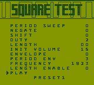

# Game Boy Square Test

Implementing the Game Boy's Audio Processing Unit (APU) is one of the most challenging parts when developing a Game Boy emulator.
Particularly, because debugging is hard and you may not want to create an exact replica, but something that simulates fast and sounds good enough.
The _Game Boy Square Test_ supports you in this process, allowing you to test features of the two square channels and evaluate their acoustical impressions.

## Usage

Open `square_test.gb` with your Game Boy emulator.
After the boot, you arrive at the following user interface:

It allows you to modify the following square-channel-related settings:

| Name   | Address | Bits        | Function                                             |
|--------|---------|-------------|------------------------------------------------------|
| NR10   | 0xFF10  | `-PPP NSSS` | Sweep period, negate, shift                          |
| NR11   | 0xFF11  | `DDLL LLLL` | Wave duty, length load                               |
| NR12   | 0xFF12  | `VVVV EPPP` | Init volume, envelope mode, period                   |
| NR13   | 0xFF13  | `FFFF FFFF` | Frequency LSB                                        |
| NR14   | 0xFF14  | `TL-- -FFF` | Trigger, length enable, frequency MSB                |

Values can be changed by selecting them and pressing left or right on the D-pad.
Once content with the configuration, move the cursor to "PLAY" and press A.
By pressing SELECT you can also switch between the following predefined settings:

| Preset | Description                                                       | Golden Reference                                           |
|--------|-------------------------------------------------------------------|------------------------------------------------------------|
| 0      | Empty preset                                                      | -                                                          |
| 1      | Simple 440Hz note.                                                | <audio controls src="readme_assets/preset8.flac"></audio>  |
| 2      | Simple 440Hz note with fadeout.                                   | <audio controls src="readme_assets/preset9.flac"></audio>  |
| 3      | Game Boy boot (first note (C6))                                   | <audio controls src="readme_assets/preset1.flac"></audio>  |
| 4      | Game Boy boot (second note (C7))                                  | <audio controls src="readme_assets/preset2.flac"></audio>  |
| 5      | Sweep up                                                          | <audio controls src="readme_assets/preset3.flac"></audio>  |
| 6      | Sweep down                                                        | <audio controls src="readme_assets/preset4.flac"></audio>  |
| 7      | Super Mario Land Goomba hop                                       | <audio controls src="readme_assets/preset5.flac"></audio>  |
| 8      | Super Mario Land mushroom consumed                                | <audio controls src="readme_assets/preset6.flac"></audio>  |
| 9      | Pokémon Blue/Red intro                                            | <audio controls src="readme_assets/preset7.flac"></audio>  |

In the table are also golden reference audio samples that were recorded from the original DMG-01 Game Boy.
_Note: As of yet Github Markdown does not support the HTML audio element. See `readme_assets` to get the golden reference samples._

## Building

In `src/square_test.asm` you find the source code of the Game Boy Square Test.
Assuming [RBGDS](https://github.com/gbdev/rgbds) is installed, it can be built with a simple `make`.
